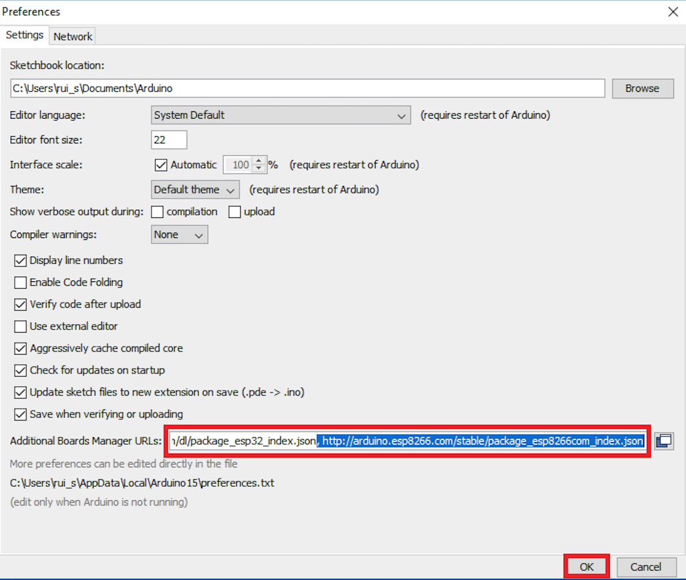

# Beehive scale with Arduino, HX711 and DHT

This Beehive scale is made with Wemos D1 mini (ESP8266 based device), which is similar to Arduino in terms of how you need to configure it.
The code is written in C, and Arduino IDE is used [https://www.arduino.cc/en/software].

# Hardware

I used HX711 chip, Wemos D1 mini [https://www.wemos.cc/en/latest/d1/d1_mini.html] and DHT 22 sensor shield for Wemos D1 mini [https://www.wemos.cc/en/latest/d1_mini_shield/dht.html]

I used board 7x5cm, which is not mandatory, but I used it to make it all compact. Red and green led diods are connected to act as indicators to know if the device is connected to WiFi and if it successfully publishes the measurements.

It is necesarry to provide WiFi access to make it all work.

Power source with 5v is need, I used car battery that has 12v and purchased converter from 12v to 5v from Aliexpress.

Scale is made of steel pipes which are connected with load cell sensor (up to 100KG) that contains strain gauge.

# Configuring Arduino IDE

1. To enable support for ESP8266 devices, you first need to go to *File>Preferences* .
Enter http://arduino.esp8266.com/stable/package_esp8266com_index.json into the "Additional Boards Manager URLs" field as shown in the figure below. Then, click the "OK" button:

2. Go to *Tools>Board* and select Lolin(Wemos) D1 mini.

3. Install *ESP8266* library by going to *Scatch>Include library>Manage Libraries*, search for *ESP8266 by ESP8266 Community* and install it.

